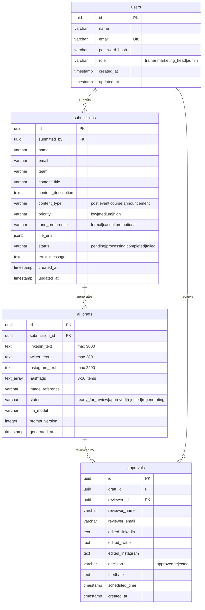
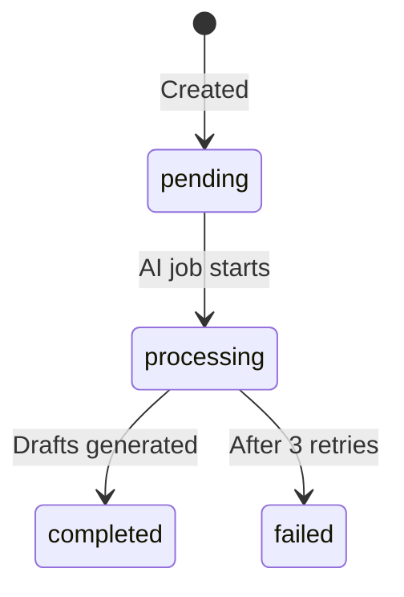
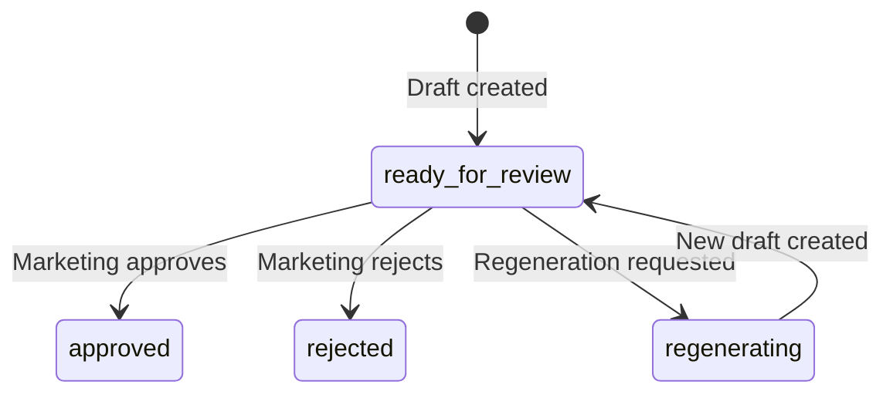

# Database ERD - AI Marketing Automation System

```mermaid
erDiagram
    users {
        uuid id PK
        varchar name
        varchar email UK
        varchar password_hash
        varchar role "trainer|marketing_head|admin"
        timestamp created_at
        timestamp updated_at
    }

    submissions {
        uuid id PK
        uuid submitted_by FK
        varchar name
        varchar email
        varchar team
        varchar content_title
        text content_description
        varchar content_type "post|event|course|announcement"
        varchar priority "low|medium|high"
        varchar tone_preference "formal|casual|promotional"
        jsonb file_urls
        varchar status "pending|processing|completed|failed"
        text error_message
        timestamp created_at
        timestamp updated_at
    }

    ai_drafts {
        uuid id PK
        uuid submission_id FK
        text linkedin_text "max 3000"
        text twitter_text "max 280"
        text instagram_text "max 2200"
        text_array hashtags "3-10 items"
        varchar image_reference
        varchar status "ready_for_review|approved|rejected|regenerating"
        varchar llm_model
        integer prompt_version
        timestamp generated_at
    }

    approvals {
        uuid id PK
        uuid draft_id FK
        uuid reviewer_id FK
        varchar reviewer_name
        varchar reviewer_email
        text edited_linkedin
        text edited_twitter
        text edited_instagram
        varchar decision "approved|rejected"
        text feedback
        timestamp scheduled_time
        timestamp created_at
    }

    users ||--o{ submissions : "submits"
    submissions ||--o{ ai_drafts : "generates"
    ai_drafts ||--o{ approvals : "reviewed by"
    users ||--o{ approvals : "reviews"
```

## State Machines

### Submission States

```mermaid
stateDiagram-v2
    [*] --> pending : Created
    pending --> processing : AI job starts
    processing --> completed : Drafts generated
    processing --> failed : After 3 retries
```

### Draft States

```mermaid
stateDiagram-v2
    [*] --> ready_for_review : Draft created
    ready_for_review --> approved : Marketing approves
    ready_for_review --> rejected : Marketing rejects
    ready_for_review --> regenerating : Regeneration requested
    regenerating --> ready_for_review : New draft created
```
